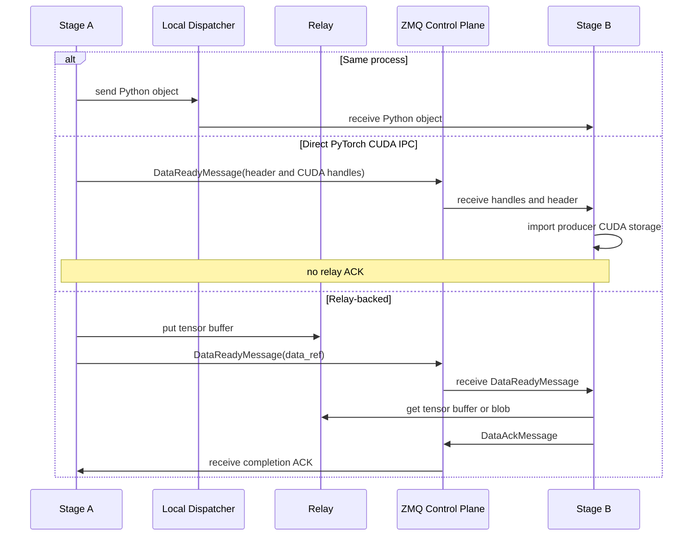

# Communication

For communication among stages in sglang-omni, ZMQ carries coordination and
serialized control metadata while `sglang_omni.comm` owns the data movement
contract. Stage code routes by stage name. The comm router chooses same-process
object passing, direct PyTorch CUDA IPC when same-placement processes use
compatible CUDA device ordinals, pooled CUDA IPC for other same-node GPU edges,
SHM for local CPU relay movement, or Mooncake for configured cross-node
movement.

The main implementation entry points are:


| File                                            | Role                                                                  |
| ------------------------------------------------- | ----------------------------------------------------------------------- |
| `sglang_omni/comm/data_ref.py`                  | Typed relay `DataRef` carried by `DataReadyMessage.data_ref`          |
| `sglang_omni/comm/router.py`                    | Locality and transport selection                                      |
| `sglang_omni/comm/engine.py`                    | Stage-facing communication facade                                     |
| `sglang_omni/comm/stage_io.py`                  | Payload and stream tensor packing/unpacking                           |
| `sglang_omni/pipeline/control_plane.py`         | ZMQ sockets, msgpack serialization, stage/coordinator message routing |
| `sglang_omni/pipeline/local_dispatch.py`        | Same-process Python object dispatch between colocated stages          |
| `sglang_omni/relay/base.py`                     | Backend interface and backend registry                                |
| `sglang_omni/relay/cuda_ipc.py`                 | Sender-owned CUDA pool, slot allocation, copies, and completion       |
| `sglang_omni/relay/{shm,nccl,nixl,mooncake}.py` | Concrete relay backends                                               |
| `sglang_omni/proto/messages.py`                 | Control-plane message types                                           |

## Transfer Model




| Path                     | Transport      | Carries                                                                                                      |
| ------------------------ | -------------- | ------------------------------------------------------------------------------------------------------------ |
| Coordination             | ZMQ `PUSH/PULL` | `SubmitMessage`, `DataReadyMessage`, `CompleteMessage`, `StreamMessage`, `ShutdownMessage`, profiler control |
| Broadcast coordination   | ZMQ `PUB/SUB`   | `AbortMessage`                                                                                               |
| Same-process movement    | LOCAL_OBJECT   | Full `StagePayload` objects and stream chunks passed by Python reference within one OS process                |
| Same-placement direct GPU movement | PyTorch CUDA IPC | CUDA storage handles plus ordinary payload or stream control metadata                              |
| Same-node pooled GPU movement | CUDA IPC relay | Packed payload tensor buffers, CUDA stream chunks, and stream metadata tensors                         |
| Local CPU relay movement | SHM relay      | Full payload tensor buffers and stream chunks that are not CUDA-local                                        |
| Cross-node movement      | Mooncake relay | Full payload tensor buffers and stream chunks over Mooncake-selected transport                               |

`DataReadyMessage.data_ref` carries either a direct PyTorch CUDA IPC envelope or
a typed relay `DataRef`. A direct envelope contains a pickled payload header or
stream metadata together with PyTorch CUDA storage handles. A relay `DataRef`
contains the object id, data kind, transport, layout, backend buffer reference,
tensor layout, and optional stream metadata. Backend-owned details from
`RelayOperation.metadata` live under `DataRef.buffer.info`.

## Normal Payload Flow

The coordinator submits the first `StagePayload` directly to the entry stage in a
`SubmitMessage`. After that, a stage-to-stage payload uses LOCAL_OBJECT, direct
PyTorch CUDA IPC, or a relay according to the edge and payload.

For direct CUDA IPC, `Stage` extracts CUDA tensor leaves, pickles the remaining
`StagePayload` as ordinary control metadata, and serializes each CUDA tensor with
PyTorch's CUDA multiprocessing reducer. It then sends one `DataReadyMessage`
containing those storage handles. The receiver maps the producer allocations and
restores the payload without a relay buffer. This path has no relay
`DataAckMessage`. Its lifetime is carried by PyTorch's CUDA IPC ownership
mechanism.

Ordinary direct-payload headers are ZMQ control metadata. Their size is not tied
to the pooled CUDA relay's slot size, and a large header is not split into relay
slots or application messages.

For a relay-backed payload:

1. The sender asks `CommRouter` for the edge transport and calls
   `CommEngine.send_payload(...)`.
2. The send worker calls `stage_io.write_payload()`, which recursively extracts
   tensors from `payload.data`, replaces them with placeholders, pickles the
   tensor-free `StagePayload`, and concatenates tensors into one `uint8` buffer.
3. The sender calls `relay.put_async()` for that buffer and sends a
   `DataReadyMessage(data_ref=...)` containing a `DataRef` with:
   - `buffer.info`: backend-specific metadata from `RelayOperation.metadata`
   - `header`: base64-encoded `StagePayload` without tensors
   - `tensors`: path, shape, dtype, offset, and byte size for each tensor
4. The receiver handles the message in `Stage._on_data_ready()`, calls
   `CommEngine.read_payload()`, waits for `relay.get_async()`, restores tensors,
   and passes the payload through the stage input handler.
5. The receiver sends one `DataAckMessage`. The sender then releases the
   operations retained for the logical envelope.
6. If fan-in is complete, the stage enqueues an `IncomingMessage` into
   `scheduler.inbox`.

The relay payload format is intentionally backend-neutral. Backends only need to
move a flat tensor buffer and return metadata that another backend instance can
use for `get_async()`.

LOCAL_OBJECT bypasses relay and the ZMQ `DataReadyMessage`: the sender calls the
process-local dispatcher, which invokes `receive_local_payload()` on the target
stage with the projected `StagePayload` object itself. This is a direct Python
reference transfer, not serialization. Receivers must treat the payload, nested
data containers, tensors, stream chunks, and metadata as read-only. The object
must also stay valid for the receiver's scheduler queue lifetime. Senders and
projection functions must not mutate or recycle objects after dispatch.

Request and control objects should retain parameters needed downstream, but they
should not retain consumed bulk media across later stage hops. The stage that
turns raw media into canonical pipeline state owns releasing those references.

For full payloads, LOCAL_OBJECT is allowed for single-target same-process routes.
For fan-out, it is allowed only when each projected payload is a `StagePayload`
with its own `data` container, so downstream stages do not share mutable payload
state. Tensor leaves may still be shared intentionally and must be treated as
read-only.

## Streaming Flow

Streaming is used for producer-consumer edges such as thinker to talker hidden
states or talker to vocoder code tensors. The stage layer exposes one sending
helper, `CommEngine.send_stream_chunk()`, and the router chooses the transport.

For same-node GPU targets:

- namespace-compatible processes on the same placement may send CUDA chunks as
  direct PyTorch CUDA IPC envelopes
- direct stream metadata may contain CUDA tensors and ordinary inline values,
  but not CPU tensors, and the direct codec retains a separate 64 KiB inline
  metadata admission limit
- other same-node GPU edges use the pooled CUDA IPC relay
- a pooled stream `DataReadyMessage` carries a `DataRef` with
  `transport="cuda_ipc"` and a `chunk_id`

For same-process stream targets:

- the stage sends the chunk through `LocalStageDispatcher.send_stream_chunk()`
- the receiver gets the original Python object and metadata by reference
- the same read-only and lifetime caveats as payload LOCAL_OBJECT apply

For nonlocal stream targets:

- the chunk is written with `write_tensor()`
- tensor-valued metadata is extracted and written as separate `DataRef`s
- the control message is sent before waiting for pending put operations
- the receiver reads the blob in `Stage._on_stream_chunk()` and enqueues a
  `stream_chunk` message into `scheduler.inbox`

The control-before-wait ordering is important for NIXL and other credit-based
backends. If the sender waited for completion before notifying the receiver, the
receiver would never start the read that releases the sender's credit.

Stream completion and stream errors are control-only messages sent with
`send_stream_signal()`.

## Relay Interface

All backends implement `Relay`:

```python
class Relay:
    async def put_async(
        self, tensor: torch.Tensor, request_id: str | None = None, dst_rank: int | None = None
    ) -> RelayOperation: ...

    async def get_async(
        self, metadata: Any, dest_tensor: torch.Tensor, request_id: str | None = None
    ) -> RelayOperation: ...

    def cleanup(self, request_id: str) -> None: ...
    def close(self) -> None: ...
```

`put_async()` returns a `RelayOperation` whose `metadata` is placed in the
control message. Both put and get operations expose
`await wait_for_completion(timeout=...)`. Stages keep the operation alive until
the transfer is safe to release.

The CUDA IPC relay owns a bounded sender-side GPU pool. Its allocation granule
defaults to 64 KiB and is configurable with `cuda_ipc_slot_size_kb`. A tensor may
reserve several contiguous slots, but those slots remain one logical transfer.
The sender publishes one `DataReadyMessage`, the receiver copies from the
exported pool range, and one logical `DataAckMessage` releases the complete
range. The slots are allocator granularity, not application-level pagination.

## Transport Selection

There is no public backend selector. `CommRouter` derives the transport from
stage locality and placement:

| Transport | Selection rule |
| --- | --- |
| `local_object` | Source and target stages share one OS process and the payload is eligible for direct local dispatch. |
| Direct PyTorch CUDA IPC | Source and target share one placement, are in separate processes, and the runtime can prove compatible process-local CUDA ordinals. The payload or stream chunk must also be direct-codec eligible. |
| `cuda_ipc` | Same-node GPU edge that does not use direct PyTorch CUDA IPC. The pooled relay supports same-GPU and cross-GPU movement. |
| `shm` | Same-node host/CPU transfer where the selected edge is not GPU-to-GPU. |
| `mooncake` | Cross-node stage edges listed as remote. Mooncake owns protocol selection for those transfers. |

`CommConfig` can tune slot size, credits, and Mooncake connection options per
stage. It does not select a transport backend.

Each backend owns only transport mechanics. It does not route requests, perform
fan-in, choose downstream stages, or interpret model payloads.

## Resource Lifetime

The stage layer follows a simple ownership rule:

- sender writes data, sends `DataReadyMessage`, then waits for the put operation
  when required by the backend
- receiver allocates the destination buffer, waits for the get operation,
  restores the payload, and calls `relay.cleanup(request_id)`
- a pooled CUDA IPC sender retains its complete slot range until the receiver's
  one logical ACK marks every operation for the envelope complete
- direct PyTorch CUDA IPC has no relay ACK and relies on PyTorch's imported
  storage lifetime
- LOCAL_OBJECT has no backend cleanup. Sender and receiver share Python object
  references, so correctness depends on read-only use until the receiver is done
- aborts call `relay.cleanup(request_id)` from the stage abort path
- stage shutdown calls `relay.close()`

Backend-specific cleanup is hidden behind that interface. For example, `shm`
unlinks blocks on receive, NIXL and Mooncake release memory-pool credits after
completion, and NCCL tears down the process group on close.
